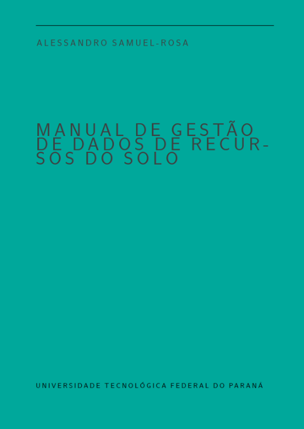

# Manual de Gestão de Dados de Recursos do Solo

A pesquisa em ciência do solo já produziu grande quantidade de dados. Contudo, a questão da gestão eficiente desses dados foi negligenciada por muito tempo. O "livro verde" do Laboratório de Pedometria vem lançar luz sobre essa questão. Construído a partir de experiências reais de gestão de dados no [Repositório Brasileiro Livre para Dados Abertos do Solo](https://www.pedometria.org/febr/), o manual lida com questões que vão da produção dos dados no campo à sua disponibilização em formato digital. Se você quiser saber mais sobre o livro ou contribuir em sua construção, [entre em contato](/#contato) conosco agora mesmo. Você pode conferir o código fonte, em `RMarkdown` e $\LaTeX$, que está disponível num repositório público no [GitHub](https://github.com/samuel-rosa/verde). Todo o conteúdo está disponível sob uma licença [CC BY-NC-SA 4.0](https://creativecommons.org/licenses/by-nc-sa/4.0/deed.pt_BR).

## Quero colaborar

Nós usamos o modelo de desenvolvimento colaborativo _fork & pull_. Isso significa que você tem liberdade para fazer um cópia paralela (_fork_) do código fonte e fazer as alterações que julgar necessárias. Tudo isso sem que seja necessário nos pedir qualquer autorização. Caso as alterações que você realizar na sua cópia pessoal do código fonte sejam interessantes e você tenha interesse em compartilhar elas conosco, então basta solicitar que sejam puxadas (_pull request_) para o código fonte original. Depois de uma revisão das suas alterações, nós decidiremos se elas podem ser fundidas (_merge_) com o código fonte original.
